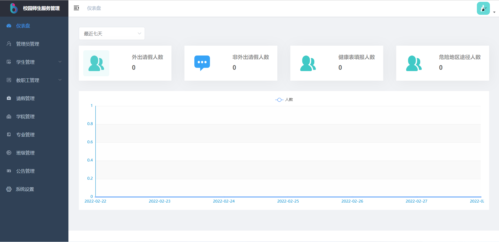
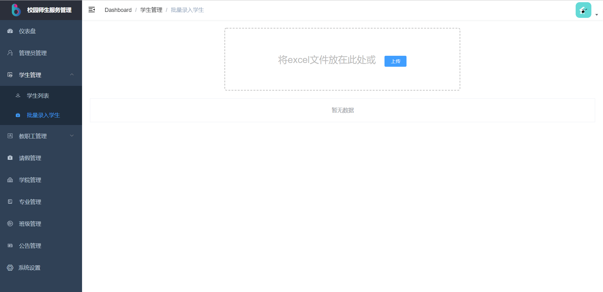
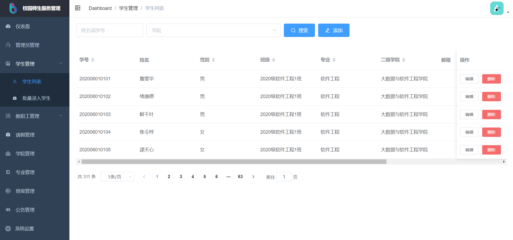
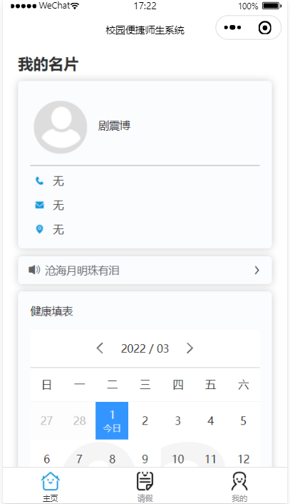
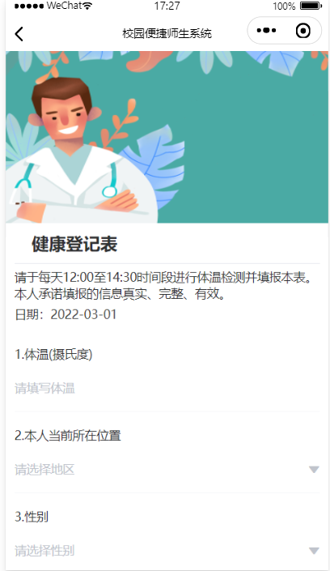
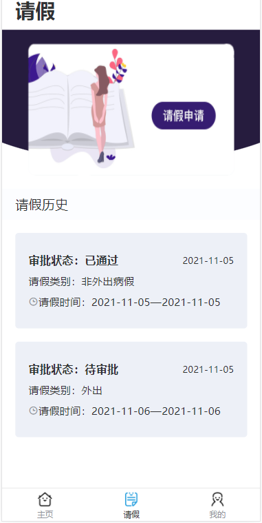
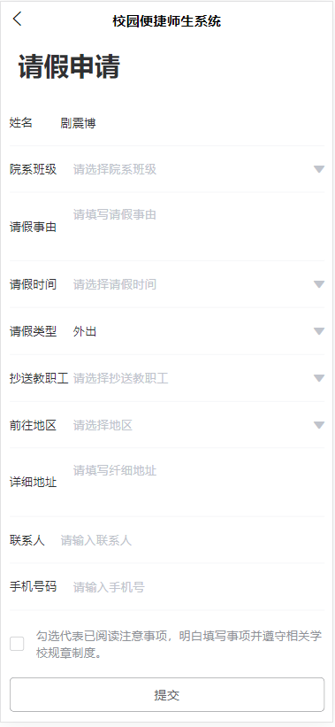

# 校园疫情防控系统

#### 介绍
> 使用群体为大学校园的教职工、辅导员及学生，主要功能为请假、批假、健康表填写、数据监控等。

#### 技术栈
> 软件架构说明
>
> 小程序：uni-app
>
> 后端：koa
>
> 管理端：vue-element-admin

#### 使用说明

> 请把数据库导入到本地数据库，请修改服务端utils文件夹下的db.js文件中的数据库配置！！！
>
> 服务端：npm run nodemon
>
> 管理端：npm  run dev
>
> 小程序端：请用HBuilder X打开,点击运行，运行到浏览器或者微信小程序，小程序文件上传功能使用阿里云OSS，本源码已屏蔽阿里云OSS地址

#### 声明

> 本系统为本人个人开发，由于本人技术有限，请多海涵！！！

#### 大致实现效果图

管理端：

1.登录页

2.首页

3.批量导入：

4.学生管理：

小程序端：

1.登录页

2.首页

3.建康表填写

4.请假

